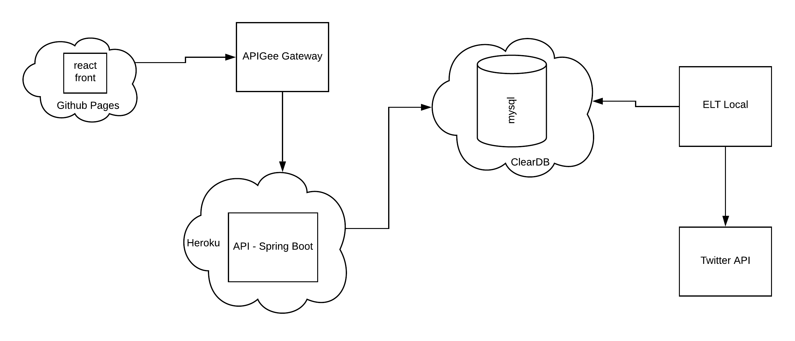

# Relatório Técnico

## Aderência ao Planejamento

- As tarefas do planejamento foram realizadas com a adição de algumas etapas não mencionadas. Como subir a API e Front para a nuvem buscando uma melhor forma para acessar a solução. 

- Dificultadores:
    - o primeiro foi disponibilidade de tempo, sendo que o mesmo já era curta e ainda tive algumas questões pessoais. Com mais tempo seria possível desenvolver uma arquitetura mais escalável, utilizando mensageria e bases diferentes para cada serviços.

    - o segundo foi o próprio escopo do teste, mais amplo, onde foi necessário atuar em soluções de diversos tipos (api, front, carga, gateway) 

## Acessos

- O código fonte está disponível em um monorepo no github https://github.com/thiagoaos/itau-test
- O Front foi disponibilizado no github pages https://thiagoaos.github.io/itau-test
- A API foi disponibilizada na cloud do heroku https://
itau-test.herokuapp.com/ (verificar os Endpoints mais abaixo);
    
## Diagrama da Arquitetura

## Diagrama da modelagem de dados

## Tecnologias Utilizadas

- Ferramentas, IDE, Editores
    - vscode para node e front-end
    - idea community para java
    - sequel pro no mac para mysql
    - mysql workbench no linux para mysql
    - docker e docker compose
    - terminal hyper
    - git

- etl (from twitter api to database)
    - nodejs 12.13
    - mysql
    - sequelize lib
    - node-fetch

    > Este app connecta a api do twitter para pegar os tweets por tags pré definidas. O tweets encontrados são transformados e armazenados em uma base mysql

- API
    - java 11
    - spring boot 2.2
    - spring data
    - springfox to swagger
    - jdbc mysql driver

    > Este app publica 3 APIs REST. É utilizado a base mysql pré populada (pelo app nodejs) para adquirir as informações 

        - Production Base Path https://itau-test.herokuapp.com
        - Local Base Path http://localhost:8080

        - GET /api/v1/tweets/total-by-tag-lang
        - GET /api/v1/tweets/total-by-hour
        - GET /api/v1/users/top5-followers

    > swagger api
        
        - /swagger-ui.html
        - /v2/api-docs

- Gateway
 
    - Apigee
    - oAuth2

     > APIs

        - GET https://thiagoaos-eval-prod.apigee.net/users/top-5-followers
        - GET https://thiagoaos-eval-prod.apigee.net/tweets/total-by-tag-lang
        - GET https://thiagoaos-eval-prod.apigee.net/tweets/total-by-hour
        - POST https://thiagoaos-eval-prod.apigee.net/oauth/client_credential/accesstoken
    

- Front-end
    - react with react hooks strategy
    - react material with pre defined template
    - fetch api

    > Endpoint
        
        - Production https://thiagoaos.github.io/itau-test/
        - Local http://localhost:3000

    > TODO

        - Paginação
        - Indicação de loading
        - Tratamento de erro

## Instalação Local

- Database

        - docker-compose up db;

- ETL 
        
        * Responsável por criar a estrutura e popular a database. Carga destrutiva, a cada vez que roda drop e recria.

        - cp etl/env.template etl/.env
        - set twitter token in .env TWITTER_BEARER_TOKEN directive
        - docker-compose up etl;

- api

        - docker-compose up api

- front

        - docker-compose up front

## Deploy

 > api para o heroku

        - heroku login
        - heroku git:remote -a itau-test
        - git subtree push --prefix api heroku master

> front para o github pages

    - npm run deploy

## Esclarecimentos

- Para conectar o front-end ao gateway o correto seria utilizar o Authorization Code Flow do oAuth 2.0 porém seria necessário ter um resource provider (criar um, facebook, twitter ...). Para o escopo do teste, que é mostrar como funciona o oAuth2, acabei usando o Client Credentials Flow para demonstrar a implementação do oAuth 2, pois ter que configurar um resource provider ou criar um iria consumir ainda mais tempo. Vale salientar o Flow utilizado não é recomendado para um front-end, mas sim para ser utilizado entre 2 back-ends (apis, schedules) de confiança.

- O docker foi utilizado somente para o ambiente de desenvolvimento para facilitar a montagem do ambiente. Utilizei imagens prontas pois não tive a necessidade de adaptar.

- A arquitetura e estratégia do etl é foi focada no contexto, onde eram somente algumas tags e poucos tweets. Para uma demanda maior o ideal é adotar uma estratégia continua e escalavel. Uma solução mais robusta seria ter etl como serveless function ativando por schedule na AWS e o conteudo consumido ser adicionado em uma mensageria como RabbitMq, o(s) consumidore(s) seriam responsável transformar e armazenar em uma base apropriada.